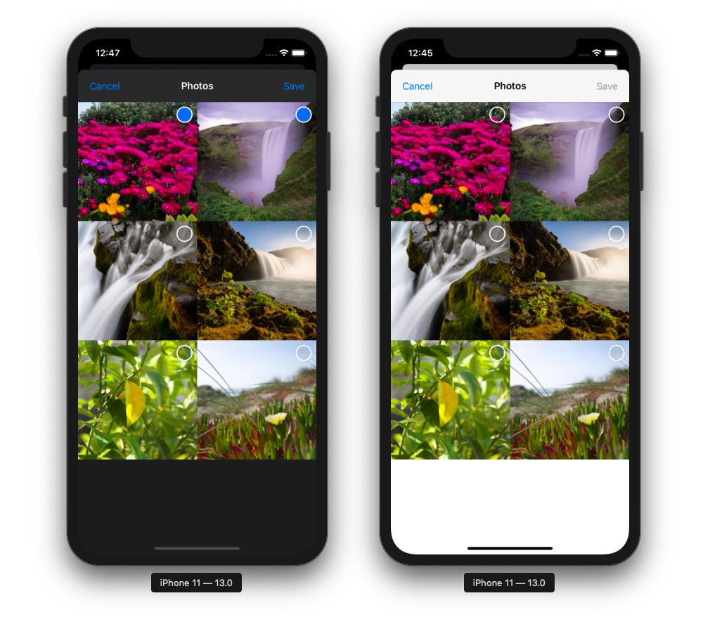

# Photo Library Picker for SwiftUI




## Installation with Swift Package Manager

Swift Package Manager is integrated within Xcode 11:

1. File → Swift Packages → Add Package Dependency...
2. Paste the repository URL: https://github.com/moifort/swiftUI-photo-library-picker.git
3. Add `NSPhotoLibraryUsageDescription` to `info.plist` 

## Usage

```swift
import SwiftUI
import PhotoLibraryPicker // Add import

struct ContentView : View {
    @State var showActionSheet: Bool = false
    @State var pictures = [Picture]()
    
    var body: some View {
        VStack {
            Button(action: {self.showActionSheet.toggle()}) {
                Image(systemName: "plus")
                    .padding()
                    .background(Color.secondary)
                    .mask(Circle())
            }.sheet(isPresented: self.$showActionSheet) {PhotoLibraryPicker(self.$pictures)}
            List {
                ForEach(pictures) { picture in
                    picture.toImage() // You can fix the size by default width: 100, height: 100
                }
            }
        }
    }
}


struct ContentView_Previews: PreviewProvider {
    static var previews: some View {
        Group {
            ContentView().environment(\.colorScheme, .dark)
            ContentView()
        }
        
    }
}
```

## Thanks

* To @dillidon for this [project](https://github.com/dillidon/alerts-and-pickers)

